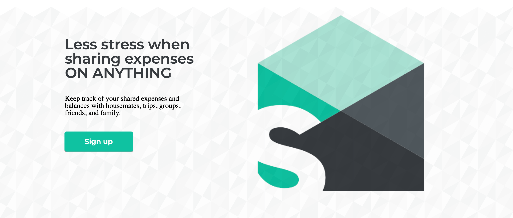
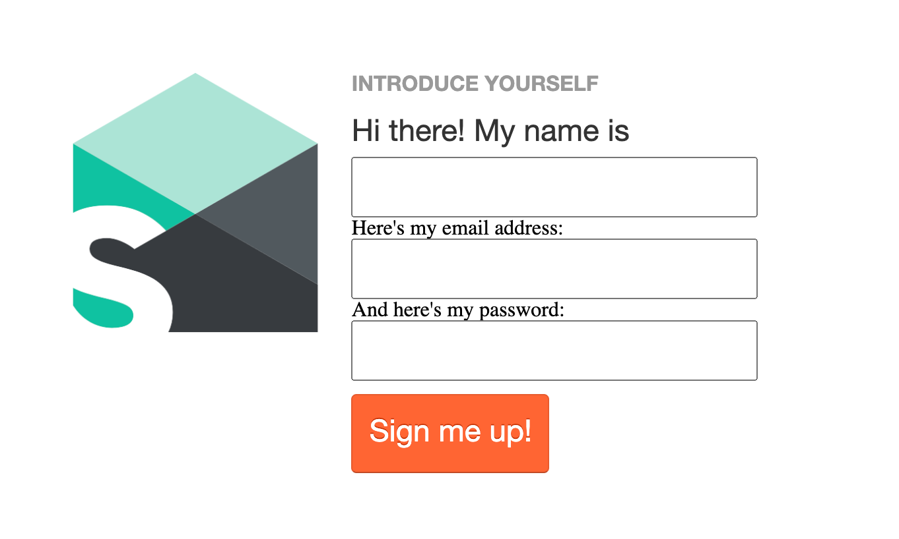
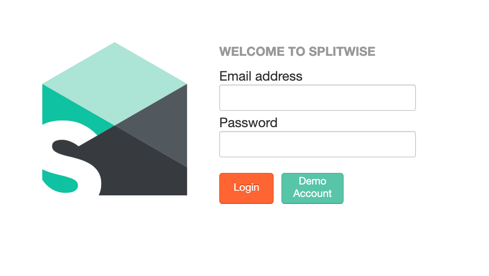

# Cleverbreak: The clever bill-splitting option
Cleverbreak is an application designed to connect with friends to send, receive, and track outstanding expenses. Users will also be able to create groups, centered around anything from monthly rent to vacation plans, to centralize expenses.

See: https://cleverbreak.herokuapp.com/#/

## Technologies
The following technologies were used in the production of Cleverbreak:
  * Ruby 2.5.1p57
  * Rails 5.2.4.3
  * PostgreSQL 12.1
  * NodeJs 10.13.0
  * React 16.13.1
  * Redux 4.0.5
  
## Features
Currently, Cleverbreak has the following features implemented:

### User Authentication
New users have the ability to register an account on the sign-in page.
New user accounts require a minimum of a name, an email address, and a password
Users can log-in and log out

## Demo Account
As an alternative to registering, a demo account feature is implemented on the login page

## Friends
Users can view list of friends

---------------
Things you may want to cover:

* Ruby version

* System dependencies

* Configuration

* Database creation

* Database initialization

* How to run the test suite

* Services (job queues, cache servers, search engines, etc.)

* Deployment instructions

* ...

